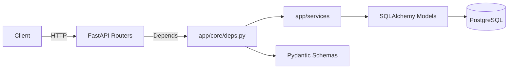
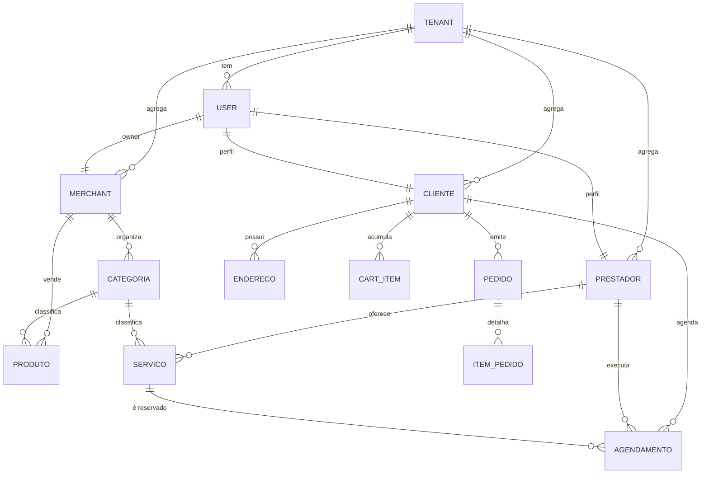
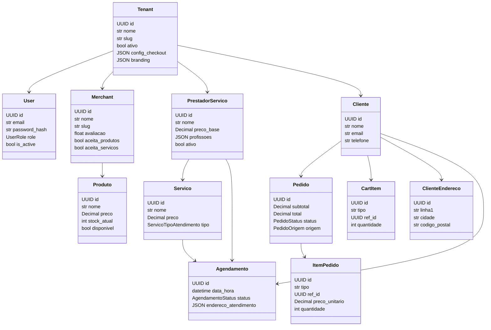
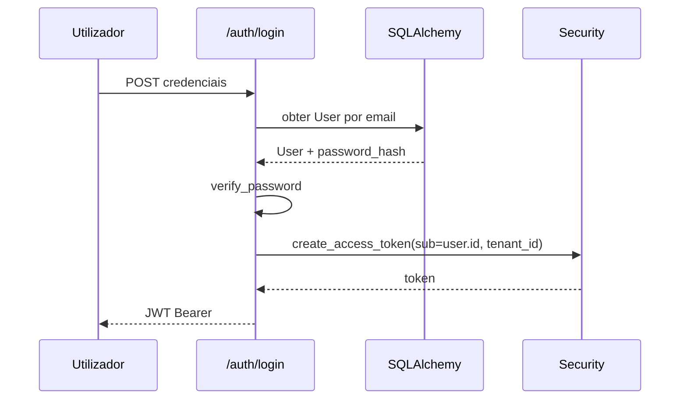
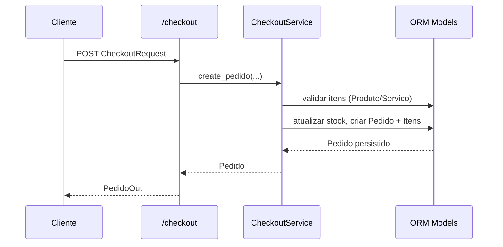
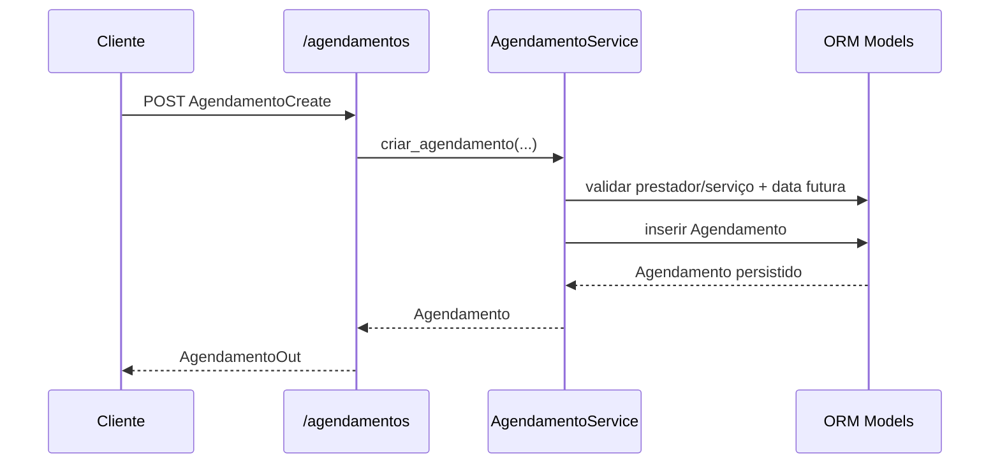

# Documentação Integral do Sistema (PT-PT)

## 1. Contexto e Objetivos
Este backend implementa um marketplace multi-tenant de produtos e serviços sobre FastAPI, SQLAlchemy 2 e PostgreSQL. O objetivo é expor APIs versionadas (`/api/v1/...`) para autenticação, gestão de tenants, catálogo, checkout, agendamentos e dashboards. A plataforma serve de referência para uma futura migração para Spring Modulith com arquitetura hexagonal e princípios DDD, mantendo isolamento de dados por tenant e fluxos críticos de comércio eletrónico.

### Requisitos Funcionais Essenciais
- Autenticação JWT com perfis `SUPERADMIN`, `CLIENTE`, `MERCHANT` e `PRESTADOR`.
- Gestão de tenants (criação, listagem, atualização) acessível a `SUPERADMIN`.
- Gestão de merchants, catálogo (categorias, produtos, serviços) e prestadores por tenant.
- Checkout com cálculo server-side e persistência de pedidos multi-itens.
- Agendamentos de serviços entre clientes e prestadores.
- Dashboards resumidos para merchants/prestadores (KPIs por tenant).

### Requisitos Não Funcionais
- Multi-tenancy por linha com `tenant_id` obrigatório em quase todas as tabelas.
- APIs idempotentes, com validações consistentes e mensagens de erro padronizadas.
- Persistência transacional em PostgreSQL e suporte a SQLite para testes.
- Cobertura de testes unitários para checkout e agendamentos críticos.
- Documentação automática via Swagger/Redoc.

## 2. Visão Arquitetural Atual
A estrutura de pastas segue a separação por camadas e bounded contexts:
- `app/api/v1/routes`: routers FastAPI focados em contextos (auth, tenants, catálogo, checkout, agendamentos, dashboard).
- `app/core`: configuração, sessão de base de dados, segurança e dependências multi-tenant (`TenantContext`).
- `app/domain`: enums e tipos de domínio (roles, estados de pedido/agendamento, origem de pedido, tipo de atendimento).
- `app/infrastructure`: modelos SQLAlchemy (`models.py`), tipos personalizados (`GUID`) e migrations Alembic.
- `app/schemas`: modelos Pydantic para requests/responses.
- `app/services`: casos de uso/coordenadores de aplicação (checkout, agendamento, tenant).

## 3. Multi-Tenancy e Segurança
- `TenantContext` é obtido pela dependência `get_tenant`, que lê `X-Tenant-ID` (slug ou UUID) e valida se o tenant está ativo.
- `TenantScopedMixin` adiciona `tenant_id` a cada entidade persistida; índices compostos reforçam o isolamento lógico.
- Auth usa OAuth2 Password Bearer. `get_current_user` decodifica JWTs emitidos por `create_access_token`, validando estado ativo do utilizador.
- Dependências auxiliares (`require_role`, `get_current_cliente`, etc.) garantem autorização contextual antes de executar serviços.

## 4. Domínios/Bouded Contexts e Equivalência para Spring Modulith
| Contexto | Responsabilidades | Principais Agregados | Endpoints | Sugestão de Módulo Modulith |
| --- | --- | --- | --- | --- |
| Identidade & Acesso | Login, emissão de JWTs, gestão de roles | `User`, `Role` | `/api/v1/auth/login`, `/api/v1/roles` | `iam` (inbound REST, outbound para repositórios de utilizadores) |
| Core Multi-Tenant | Criação/listagem/edição de tenants | `Tenant` | `/api/v1/tenants` | `tenancy` (porta de administração + repositórios `Tenant`)
| Catálogo & Merchants | Merchants, categorias, produtos, serviços, prestadores | `Merchant`, `Categoria`, `Produto`, `PrestadorServico`, `Servico` | `/api/v1/merchants`, `/api/v1/catalog/*` | `catalogo` (submódulos `merchant` e `servico`)
| Clientes & Carrinho | Clientes, endereços, items de carrinho | `Cliente`, `ClienteEndereco`, `CartItem` | `/api/v1/clientes`, `/api/v1/cart` | `cliente` (porta REST + eventos carrinho)
| Checkout & Pedidos | Validação de itens, controlo de stock, criação de pedidos | `Pedido`, `ItemPedido` | `/api/v1/checkout`, `/api/v1/pedidos` | `checkout` (ports para catálogo/stock e pagamentos)
| Agendamentos | Reservas de serviços, regras temporais | `Agendamento` | `/api/v1/agendamentos` | `agenda` (orquestração entre `cliente`, `prestador`, `servico`)
| Dashboards | KPIs e estatísticas | dados agregados | `/api/v1/dashboard/*` | `dashboard` (consome repositórios de pedidos/agendamentos)

Ao migrar para Spring Modulith com arquitetura hexagonal: cada contexto vira um módulo autonómo com ports inbound (REST controllers, mensageria) e outbound (repositories, integrações externas). Utilize interfaces (ports) para encapsular regras de negócio e Lombok para reduzir boilerplate em entidades e DTOs.

## 5. Modelo de Dados (ERD)

### Notas de Modelagem
- Todas as entidades (exceto `Role`) herdam `TimestampMixin` para auditoria.
- `GUID` personalizado garante compatibilidade UUID entre PostgreSQL e SQLite (testes).
- `Pedido` guarda snapshots de cliente e endereço para resilência contra alterações posteriores.
- `CartItem`/`Checkout` atualizam `stock_atual` de produtos e persistem agregados `Pedido` + `ItemPedido` numa única transação.
- `Agendamento` armazena metadados do formulário e o endereço de atendimento (JSON) permitindo flexibilidade para serviços presenciais/online.

## 6. Diagrama de Classes (Domínio Principal)

## 7. Fluxos de Caso de Uso
### 7.1 Login

### 7.2 Checkout

### 7.3 Agendamento

## 8. Estratégia de Migração para Spring Modulith + Hexagonal + DDD
1. **Definir módulos Modulith** alinhados aos bounded contexts (ver tabela). Cada módulo contém camadas `application` (services/orchestradores), `domain` (entidades/agregados, eventos) e `infrastructure` (repositories/JPA, adapters externos).
2. **Ports & Adapters**:
   - *Inbound ports*: interfaces na camada `application` expostas via REST controllers, mensageria ou schedulers.
   - *Outbound ports*: interfaces de repositório, integrações de pagamento/notificação implementadas em `infrastructure` com Spring Data, Feign, etc.
3. **Entidades DDD com Lombok**: mapeie os modelos SQLAlchemy para entidades JPA anotadas (`@Entity`) com `@Getter`, `@Builder`, `@EqualsAndHashCode`. Use `@Embedded` para snapshots e objetos-valor (ex.: endereço).
4. **Serviços de Aplicação**: traduza `checkout_service.py` e `agendamento_service.py` para `ApplicationService` com transações Spring (`@Transactional`) e validações. Portos outbound consultam repositórios (`ProdutoRepository`, `ServicoRepository`, etc.).
5. **Contextos Compartilhados**: `TenantContext` torna-se componente cross-module (ex.: `TenantContextHolder`). Use filtros HTTP ou interceptors para resolver o tenant antes de chamar serviços.
6. **Eventos de Domínio**: aproveite `ApplicationEventPublisher` para publicar `PedidoCriadoEvent` ou `AgendamentoCriadoEvent`, permitindo dashboards reagirem sem acoplamento forte.
7. **Migração de Tests**: reescreva `pytest` para testes `@SpringBootTest`/`@DataJpaTest`, assegurando regras multi-tenant, validações de stock e restrições temporais.
8. **Infraestrutura**: implemente multi-tenancy via `tenant_id` na chave composta ou `Hibernate Filter`. Utilize `Flyway`/`Liquibase` para migrations equivalentes às Alembic.

## 9. Considerações Operacionais
- **Transações**: Checkout e agendamento exigem `commit` único para manter consistência (produtos têm stock decrementado no mesmo `Session`).
- **Validação temporal**: `criar_agendamento` rejeita datas no passado; replicar esta regra com validações bean/hora.
- **Indices & Performance**: índices multi-coluna em `Categoria`, `Produto`, `CartItem`, `Pedido`, `Agendamento` suportam queries frequentes por tenant/cliente.
- **Observabilidade**: exposições `/docs`, `/redoc` e `/openapi.json` facilitam handover; replicar com SpringDoc.
- **Seed/Testes**: script `scripts/seed_data.py` cria dados demo (tenant + utilizadores). Tests `tests/test_checkout.py` e `tests/test_agendamentos.py` demonstram regras essenciais.

## 10. Checklist para Reimplementação
1. Replicar modelo de dados (UUIDs, mixins de auditoria, JSON) em JPA, garantindo colunas `tenant_id` e índices apropriados.
2. Criar módulos Modulith `tenancy`, `iam`, `catalogo`, `cliente`, `checkout`, `agenda`, `dashboard`.
3. Implementar interceptores para resolver `TenantContext` a partir de cabeçalho equivalente (`X-Tenant-ID`).
4. Mapear endpoints REST mantendo contratos (Pydantic schemas -> DTOs/records Java).
5. Reaproveitar regras de negócio dos serviços Python como lógica de domínio (agregados + policy services).
6. Adotar testes automatizados cobrindo fluxos descritos nas secções 7.2 e 7.3.

Esta documentação serve como blueprint completo para compreender o funcionamento do backend atual e planear uma migração consistente para Spring Modulith com arquitetura hexagonal e DDD.
